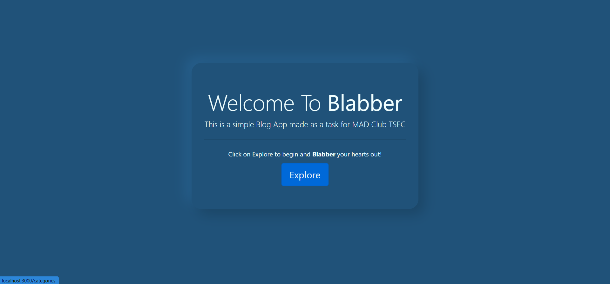
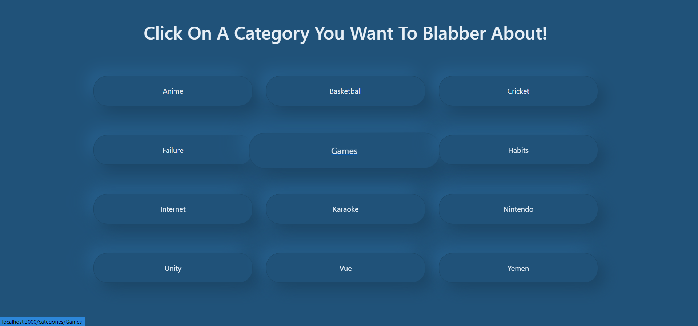
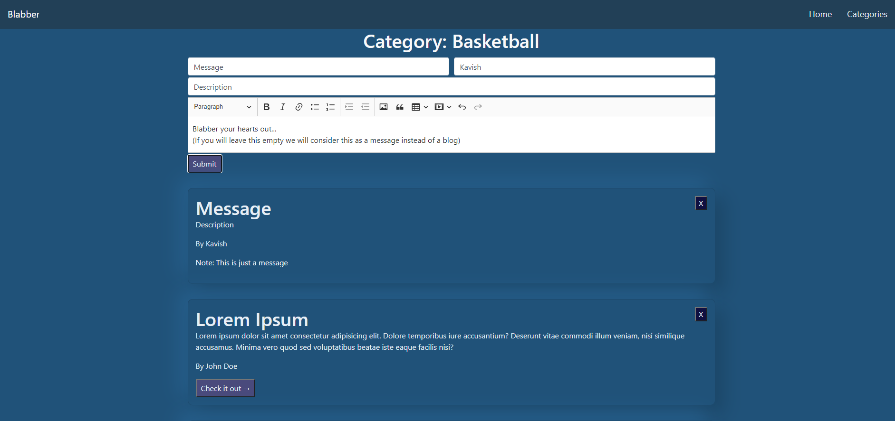
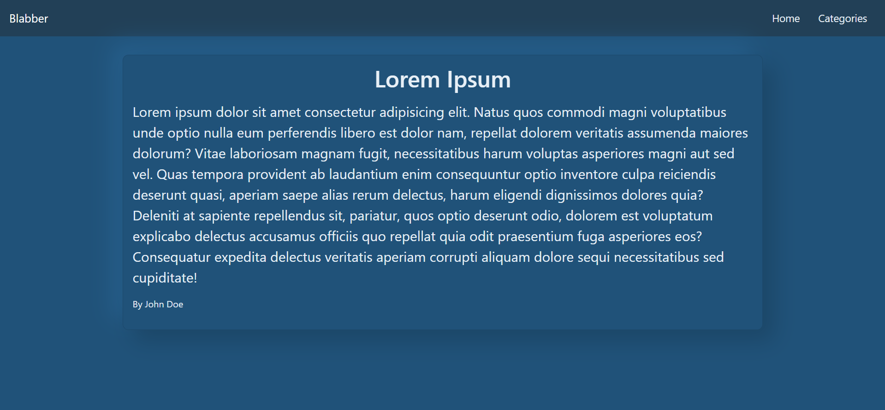

# Blabber

> A simple Blog App that allows you to add blog in chosen categories

## Quick Start

```bash
# Clone the repository
git clone https://github.com/KavishShah09/Blabber.git
# install dependencies
npm install
```

## Available Scripts

In the project directory, you can run:

### `npm start`

Runs the app in the development mode.<br />
Open [http://localhost:3000](http://localhost:3000) to view it in the browser.

The page will reload if you make edits.<br />
You will also see any lint errors in the console.

<p align="center">
 
 <br>
 <br>
 
 <br>
 <br>
 
 <br>
 <br>
 
</p>

## App Info

### Author [Kavish Shah](http://www.linkedin.com/in/kavish-shah-501b32192)

### Version 1.0.0
